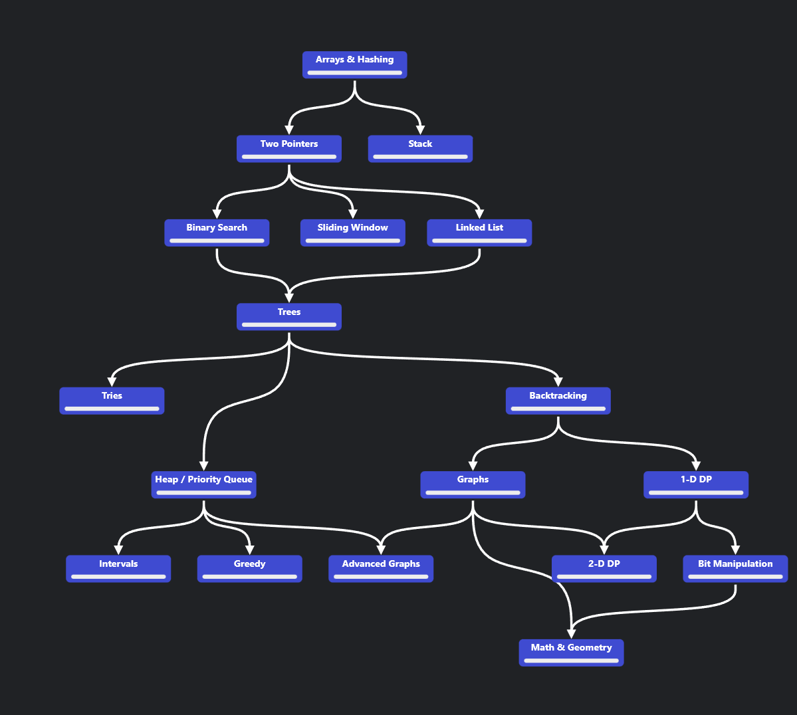

# Ну што, решаем-с..

| № | Номер задачи                               | Сложность | Тип        | Итог |
|---|--------------------------------------------|----------|------------|-|
| 1 | [1](./Hash_table/3/task_1.md)              | Easy         | Hash Table |&#x2714;|
| 2 | [13](./Hash_table/homework/1/task_13.md)   | Easy         | Hash Table ||
| 3 | [49](./Hash_table/4/task_49.md)            | Medium         | Hash Table |&#x2714;|
| 4 | [205](./Hash_table/homework/2/task_205.md) | Easy         | Hash Table ||
| 5 | [217](./Hash_table/1/task_217.md)          | Easy         | Hash Table |&#x2714;|
| 6 | [219](./Hash_table/homework/3/task_219.md) | Easy         | Hash Table ||
| 7 | [242](./Hash_table/2/task_242.md)          | Easy         | Hash Table |&#x2714;|
| 8 | [347](./Hash_table/5/task_347.md)          | Medium         | Hash Table |&#x2714;|
| 9 | [389](./Hash_table/homework/4/task_389.md) | Easy         | Hash Table ||

